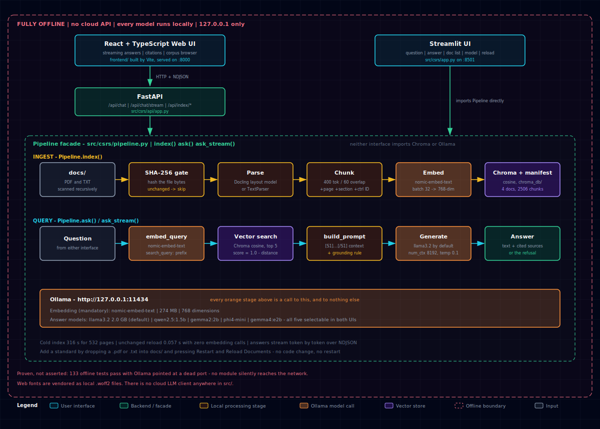

# CSRS — Cybersecurity Standards RAG System


-000000)


Ask questions about cybersecurity standards and get answers grounded in the documents
themselves, with page-level citations. Everything runs locally: the language models, the
embeddings, and the vector store. **No cloud API is used or permitted.**



```
Question → nomic-embed-text → Chroma (cosine) → top-k chunks → llama3.2 → grounded answer
```

Built on [Ollama](https://ollama.com), with
[Docling](https://github.com/docling-project/docling) for layout-aware PDF parsing.

**New here?** [Submission.md](Submission.md) is the component-by-component walkthrough:
what each module does, which task requirement it satisfies, and how the pieces connect.

### Two interfaces, one pipeline

Both talk to the same `Pipeline` facade and give the same grounded answers.

| | **Web UI** (React + FastAPI) | **Streamlit** |
|---|---|---|
| Run | `uv run csrs-api` | `uv run streamlit run src/csrs/app.py` |
| URL | http://127.0.0.1:8000 | http://localhost:8501 |
| Answers stream token by token | yes | no |
| Live retrieval progress | yes | indexing only |
| **Citations shown** | **yes — page, section, control ID, score** | no |
| Corpus browser | yes | document list only |
| Conversation history | yes (local, in-browser) | no |
| Extra requirement | Node 18+ to build once | none |

The Streamlit app is the interface the task specification asks for and is kept intact. The
web UI was added on top of the finished pipeline; it renders the citations the Streamlit
interface never displayed, which is the main reason it exists.

The reasoning behind each choice — and the measurements that drove it — is in
[Submission.md](Submission.md). The diagram above is also available as a browsable page
with PNG and PDF export: `assets/architecture.html`.

---

## Quick start

Five commands, assuming [Ollama](https://ollama.com/download) and
[uv](https://docs.astral.sh/uv/getting-started/installation/) are installed:

```bash
uv sync                                              # 1. Python dependencies
ollama serve &                                       # 2. start Ollama (skip if already running)
uv run python scripts/warm_models.py --pull-ollama   # 3. models: ~14 GB Ollama + ~1.3 GB Docling
python scripts/fetch_docs.py                         # 4. corpus (stdlib only, no venv needed)
```

Then start **either** interface:

```bash
# Web UI — build the frontend once, then serve everything on one port
(cd frontend && npm install && npm run build)
uv run csrs-api                                      # http://127.0.0.1:8000

# or Streamlit
uv run streamlit run src/csrs/app.py                 # http://localhost:8501
```

> **The first launch takes about five minutes** and the page will look idle while it works.
> That is the one-time document index being built — 492 pages of SP 800-53 through a layout
> model. Every launch after that reuses it and starts in well under a second. See
> [Why the first run is slow](#why-the-first-run-is-slow).

---

## Installation

### 1. Prerequisites

| Requirement | Why | Install |
|---|---|---|
| **Python 3.12** | Pinned in `.python-version`; `uv` fetches it if absent | handled by `uv` |
| **uv** | Lockfile-based reproducible installs | `curl -LsSf https://astral.sh/uv/install.sh \| sh` |
| **Ollama** | Runs every model locally | [ollama.com/download](https://ollama.com/download) |

Roughly **20 GB of free disk** is needed: ~14 GB of Ollama models, ~1.3 GB of Docling
weights, and ~150 MB of corpus and index.

### 2. Python dependencies

```bash
uv sync
```

Installs from `uv.lock`, so the environment is byte-for-byte reproducible. Dependencies are
declared in `pyproject.toml` (there is no `requirements.txt`; the lockfile supersedes it).

### 3. Start Ollama

```bash
ollama serve
```

Leave it running. On macOS, `brew services start ollama` runs it as a persistent background
service instead, which survives reboots and is what we'd recommend.

Verify it is reachable:

```bash
curl -s http://127.0.0.1:11434/api/tags | head -c 80
```

### 4. Download the models

```bash
uv run python scripts/warm_models.py --pull-ollama
```

One command fetches everything the application needs to run offline:

- the mandatory embedding model, **`nomic-embed-text`**;
- all five supported LLMs — `llama3.2`, `qwen2.5:1.5b`, `gemma2:2b`, `phi4-mini`,
  `gemma4:e2b`;
- Docling's layout and TableFormer weights (OCR weights are deliberately *not* fetched — the
  corpus is digital-native, so OCR is never used).

It is idempotent: run it again and everything already present is skipped. Without
`--pull-ollama` it reports what is missing and prints the `ollama pull` commands rather than
downloading several gigabytes unasked.

Expected output ends with:

```
Summary:
  Docling: ready
  Ollama: 6 of 6 required models present
  FlashRank: deferred until T-3.5 selects the reranker model

All required model weights are present.
```

(The FlashRank line refers to the deferred reranker — see
[Known limitations](#known-limitations). Nothing needs to be installed for it.)

**This is the only step that needs the internet.** Everything after it is fully offline.

### 5. Get the corpus

```bash
python scripts/fetch_docs.py
```

Deliberately stdlib-only, so it works with the system Python *before* `uv sync` if you like.
It downloads the two large NIST standards and skips anything already committed. Use
`--force` to re-download.

Most standards are **not** committed to the repository for licensing reasons — see
[What ships, and what doesn't](#what-ships-and-what-doesnt).

---

## Running the application

### Web UI

Build the frontend once, then FastAPI serves the built assets and the API together on a
single port:

```bash
(cd frontend && npm install && npm run build)
uv run csrs-api
```

Open **http://127.0.0.1:8000**. It binds to loopback only — there is no authentication
because nothing off your machine can reach it.

While working on the frontend, run it in dev mode instead. Two processes, with Vite
proxying `/api` to the backend:

```bash
uv run uvicorn csrs.api.app:app --host 127.0.0.1 --port 8000   # terminal 1
cd frontend && npm run dev                                     # terminal 2 -> :5173
```

The interface gives you:

- a **question box**, with answers **streaming in token by token** and live retrieval stages;
- **citations** under every answer — document, page, section breadcrumb, control ID and
  cosine score, expandable to the retrieved text;
- a sidebar of **application settings** — model selector, `top_k`, temperature, and a live
  Ollama indicator;
- the **list of indexed documents** with page and chunk counts;
- **Restart & Reload Documents**, plus a full rebuild behind a confirmation;
- a **Corpus** tab for browsing the indexed chunks;
- **conversation history**, stored in your browser only.

### Streamlit

```bash
uv run streamlit run src/csrs/app.py
```

Open **http://localhost:8501**. It offers the question box, the generated answer with the
model named underneath, the sidebar settings, the indexed-document list, and the reload
buttons. Another port: `--server.port 8502`.

Both interfaces read the same index, so you can run them at once. Only trigger a **rebuild**
from one of them at a time.

### Stopping and restarting

**The daemons are cheap; loaded models use the memory.** Ollama normally keeps a model
loaded for five minutes after a query, and CSRS extends that to 30 minutes for the answer
model through `CSRS_KEEP_ALIVE`. Model weights consume gigabytes; the idle processes only
consume tens of megabytes:

| Process | Role | Idle resident memory |
|---|---|---:|
| `ollama serve` | Local model server, running as a Homebrew service | ~20 MB |
| `csrs-api` | FastAPI backend and built Web UI | ~21 MB |
| `vite` | Frontend dev server, only during frontend work | ~50 MB |

So unloading the model weights is usually more useful than shutting down the server:

```bash
ollama ps                 # show the models resident in memory
ollama stop <model-name>  # unload one model
```

To stop everything:

```bash
pkill -f 'csrs-api'
pkill -f 'frontend/node_modules/.bin/vite'
pkill -f 'streamlit run src/csrs/app.py'
brew services stop ollama
```

Ctrl-C in the terminal that owns `csrs-api`, Vite, or Streamlit works too. If the development
backend shown above is running instead of `csrs-api`, use Ctrl-C in its terminal or run
`pkill -f 'uvicorn csrs.api.app:app'`. Ollama is a Homebrew service, so it restarts at login
unless it is stopped with `brew services stop ollama`.

Check the four application ports:

```bash
lsof -nP -iTCP:8000 -iTCP:5173 -iTCP:8501 -iTCP:11434 -sTCP:LISTEN
```

No output means everything is down. To bring it back, run `brew services start ollama`, then
use the Web UI, frontend development, or Streamlit commands already documented above.

**Stopping these processes does not cost a re-index.** The persistent 35 MB index lives in
`chroma_db/` — including `chroma.sqlite3`, Chroma's vector index files, and `manifest.json` —
and survives every process restart. Startup runs an incremental index check, not a full
rebuild. At `src/csrs/pipeline.py:127`, each file's SHA-256 is compared with the manifest;
unchanged files are skipped before parsing or embedding. With an unchanged corpus, that
check takes about 40-80 ms and makes zero embedding calls. See
[Adding new documents](#adding-new-documents) for how the content hashes work.

Only three things force the roughly 316-second cold rebuild:

1. `POST /api/index/rebuild` or `Pipeline.index(force=True)`, including the
   **Full Rebuild Documents** button.
2. Deleting or moving `chroma_db/`.
3. A disagreement between the store and manifest. The consistency guard at
   `src/csrs/pipeline.py:111-117` resets and rebuilds when manifest identities are invalid
   or the stored chunk counts do not match the manifest.

Only the third can happen by accident — kill a process mid-index, after the store and
manifest have diverged. Processes can be stopped freely whenever an index run is not in
flight.

One quick sanity check:

```bash
python3 -c "import json;m=json.load(open('chroma_db/manifest.json'));print(len(m),sum(r['chunk_count'] for r in m.values()))"
```

For the shipped index, it prints:

```text
4 2506
```

### Try these

Measured against the shipped corpus on a warm index:

| Question | Result |
|---|---|
| *What are the functions of the NIST Cybersecurity Framework?* | answered in 1.7 s — CSF 2.0 p.2 @ 0.8049 |
| *How is Incident Response handled?* | answered in 4.1 s — SP 1299 p.7 @ 0.8164 |
| *What are the requirements for Asset Management?* | answered in 3.4 s — CSF 2.0 p.23 @ 0.7744 |
| *What does AC-2 require for account management?* | answered — SP 800-53 p.46 @ 0.8056, control `AC-2` |
| *What does ISO 27001 require for access control?* | **refuses — and that is correct** |

**On that last one:** ISO 27001 is not freely redistributable, so it is not in the shipped
corpus. Refusing is the system working — it declines rather than answering from the NIST
documents it *does* have. Add your own copy to `docs/`, reload, and the question answers.

Ask something plainly outside the documents — *What is the best recipe for chocolate chip
cookies?* — and it refuses too, while still showing which passages it retrieved and judged
insufficient.

---

## Adding new documents

**Drop a file into `docs/` and press "Restart & Reload Documents". That's the whole process.**

```bash
cp ~/Downloads/CIS_Controls_v8.1.pdf docs/
```

No code change, no restart, no configuration. `.pdf` and `.txt` are supported, and
subdirectories are scanned too. The new file is parsed, chunked, embedded and queryable — a
small document lands in well under a second.

Two buttons, because they cost very different amounts:

| Button | What it does | When |
|---|---|---|
| **Restart & Reload Documents** | Indexes only what changed | Almost always |
| **Full Rebuild Documents** | Reprocesses everything (~5 min) | Only if the index looks wrong |

The reload is incremental because every file is fingerprinted by a SHA-256 of its **bytes**,
checked *before* the parser runs. Unchanged files are skipped without being opened, changed
files are reprocessed, and deleted files have their chunks removed. Content is hashed rather
than modification time, so a `git checkout` — which rewrites mtimes constantly — does not
trigger a five-minute rebuild.

One constraint: **filenames must be unique** across `docs/`, including subdirectories.
Duplicate names are rejected with a clear error rather than silently indexed twice.

---

## Configuration

Every tunable lives in `src/csrs/config.py` and can be overridden by an environment variable
or a `.env` file, all prefixed `CSRS_`. Copy `.env.example` to `.env` to start.

```bash
CSRS_DEFAULT_LLM=qwen2.5:1.5b     # faster, less reliable at staying grounded
CSRS_RETRIEVAL_MODE=dense         # 'hybrid' (default) fuses BM25 with dense; 'dense' is semantic only
CSRS_TOP_K_DENSE=20               # retrieval candidate pool
CSRS_RERANK_TOP_N=5               # chunks that actually reach the model
CSRS_RERANK_ENABLED=true          # cross-encoder rerank; off by default, see limitations
CSRS_CHUNK_SIZE=400               # approximate tokens
CSRS_PDF_PARSER=pypdf             # emergency fallback; see below
```

`CSRS_EMBED_MODEL` exists but should not be changed. `nomic-embed-text` is mandated by the
spec, and `embeddings.py` applies that model's specific `search_document:` / `search_query:`
task prefixes. Pointing it at another model would silently degrade retrieval rather than
fail loudly.

---

## What ships, and what doesn't

Two standards are committed in `docs/samples/`, so a fresh clone is queryable with no
download at all — one PDF and one TXT, so both parsing paths are exercised immediately:

| File | Licence |
|---|---|
| `NIST.CSWP.29_CSF-2.0.pdf` | US Government work — public domain |
| `OWASP_Top_10_2021.txt` | CC BY 4.0 © OWASP Foundation |

`scripts/fetch_docs.py` adds **NIST SP 800-53 Rev. 5** (492 pages) and **NIST SP 1299**.

Two of the standards named in the task specification are **deliberately absent**:

- **ISO/IEC 27001:2022** is copyrighted and sold by ISO. Shipping it would be infringement,
  so it is excluded. Asking *"What does ISO 27001 require for access control?"* therefore
  returns a refusal — **that is correct behaviour**, not a bug. Drop a licensed copy into
  `docs/` and it works like any other document.
- **CIS Controls v8.1** is free but requires registration, and its terms restrict
  redistribution. Same story: download it yourself, drop it in.

Full licensing detail is in [docs/README.md](docs/README.md).

---

## Retrieval quality, measured

Retrieval is **hybrid**: dense cosine search and a BM25 keyword index are run in parallel
and merged by reciprocal rank fusion. Quality is measured against `eval/golden_set.yaml` —
48 hand-written question/answer pairs across exact control-ID lookup, semantic paraphrase,
cross-document, out-of-scope (must refuse), and the specification's own example questions.

```bash
uv run --group eval python eval/run_eval.py --no-generate
```

Over the 37 answerable pairs:

| configuration | rank-1 | Recall@5 | Recall@10 | MRR | nDCG@10 |
|---|---|---|---|---|---|
| dense only | 27/37 | 0.454 | 0.573 | 0.834 | 0.628 |
| **hybrid — the default** | **29/37** | **0.461** | 0.565 | 0.855 | 0.625 |
| hybrid + rerank (MiniLM-L-12) | 33/37 | 0.439 | 0.525 | 0.920 | 0.624 |

**Read the first two columns, not the last three.** The golden set resolves a control to
*all* of its chunks, so Recall@10 and nDCG@10 reward retrieving a whole control family —
but only 5 chunks ever reach the model. Rank-1 hit rate and Recall@5 are what a user
experiences. On those, hybrid wins, and its real prize is exact control-ID lookup going
from 0.896 MRR to a perfect **1.000** — which is what BM25 was added for.

Refusal behaviour is measured on the same set: 8 of 11 out-of-scope questions are correctly
refused, with **zero** false refusals of answerable ones.

---

## Known limitations

Stated plainly, because a system that hides its failure modes is harder to trust than one
that names them. Measurements and analysis are in [Submission.md](Submission.md).

**No conversational memory.** Each question is answered independently. This has a concrete,
reproducible cost: *"Explain the Identify function."* — asked cold — retrieves SP 800-53's
`SI-19 DE-IDENTIFICATION` and answers confidently about the wrong thing. Ask *"Explain the
Identify function **of the NIST Cybersecurity Framework**"* and it is correct. Bare
"Identify" collides lexically with de-identification, and SP 800-53 is 2119 of the corpus's
2506 chunks. Follow-up context is marked a bonus in the specification and was not built;
this is exactly what it would fix. **Phrase questions to name the standard.**

**Refusal detection is exact-match.** A model that refuses *in its own words* rather than
emitting the configured refusal string is recorded as having answered. This under-reports
refusals; it never causes a wrong answer.

**Reranking is built but disabled.** A cross-encoder rerank puts the right chunk first far
more often — 33 of 37 questions versus 29 — and costs **1.6 s per query** on this hardware,
against a ~30 ms budget. flashrank's smaller model runs in 82 ms but ranks *worse than no
reranking at all*. There is no middle option in its model registry, so `rerank_enabled`
ships `False`. Turn it on with `CSRS_RERANK_ENABLED=true` if you would rather have the
precision than the second and a half.

**Parent–child retrieval is not built.** The model receives the exact retrieved passages,
with no expansion to their surrounding section. Grounding is honest but sometimes narrower
than a reader would like.

**Smaller models are less reliable.** All five required LLMs are selectable, but they are not
equally good at staying grounded. `qwen2.5:1.5b` has been observed refusing a question that
is squarely *in* the corpus and that `llama3.2` and `gemma2:2b` both answered from identical
retrieved chunks. Re-measured through the API: *"What does control AC-2 require for account
management?"* is refused by `qwen2.5:1.5b` at both `top_k=3` and `top_k=5`, and answered by
`llama3.2` at both — so it is the model, not the amount of context. `llama3.2` is the default
for this reason. **If you switch models and start seeing refusals, switch back before
concluding retrieval is broken.**

**Citations are structural, not inline.** The web UI shows every retrieved chunk with its
document, page, section breadcrumb, control ID and score. What it cannot do is mark *which
sentence* came from *which* source: the model does not emit citation markers, so attributing
individual claims would mean guessing. The sources are what was retrieved and given to the
model, not a per-claim provenance trail. The Streamlit interface does not display them at
all.

**The web UI needs Node once.** Building `frontend/dist` requires Node 18+. After that the
build is static and the app is fully offline. The Streamlit interface needs no Node at all,
so the project remains runnable on a machine without it.

**Deleting `chroma_db/` while the app is running** leaves a stale database handle and
produces a readonly error. Restart the app. Don't delete the index out from under a live
process.

---

## Why the first run is slow

PDFs are parsed by **Docling**, which runs a real document-layout model over every page
rather than scraping the text layer. That costs about **2 pages/second** — the full corpus
indexes in roughly **five minutes** (measured: 316 s for 4 documents and 2506 chunks).

It buys structural correctness that regex heuristics could not deliver. Running headers and
footers are classified as furniture and dropped by construction; tables come out as real
Markdown tables; section headings are identified as headings. An earlier hand-rolled parser
needed four rounds of increasingly specific rules to suppress SP 800-53's page furniture, and
each round was only found by testing against a document the previous round hadn't seen. That
approach doesn't extend to standards nobody has looked at yet — which is precisely what the
"drop a new document in" requirement asks for.

The cost is paid once. Because the index is content-hashed, a restart with an unchanged
corpus reloads in **0.057 s**.

If you need speed over fidelity, `CSRS_PDF_PARSER=pypdf` selects a fast text-layer fallback.
It degrades honestly — thinner section breadcrumbs, less reliable furniture removal — and is
an emergency path, not a supported quality tier.

---

## Development

```bash
uv run ruff check .                                              # lint
CSRS_OLLAMA_HOST=http://127.0.0.1:9 uv run pytest -q -m "not ollama and not docling"
uv run pytest -q -m docling                                      # needs Docling weights
uv run pytest -q -m ollama                                       # needs a live Ollama
uv run --group eval python eval/validate_golden_set.py           # needs the built index
```

The offline suite (133 tests) points at a dead port on purpose: it proves nothing silently
reaches the network. Tests needing real models are marked and deselected by default.

### Project layout

```
src/csrs/
  config.py       every tunable, typed, in one place
  models.py       Chunk, Document, RetrievedChunk, Answer
  loaders/        docling_parser.py (default) | pdf.py (fallback) | text.py
  chunking.py     structure-aware splitter, emits hierarchy breadcrumbs
  embeddings.py   the only module that owns the nomic task prefixes
  store.py        Chroma + the content-hash manifest
  generation.py   prompt assembly, grounding instruction, refusal, token streaming
  pipeline.py     the single facade both UIs talk to
  app.py          Streamlit
  api/app.py      FastAPI — chat, streaming, index control, corpus, static hosting

frontend/
  src/App.tsx           chat orchestration and the streaming send flow
  src/lib/api.ts        the only module that knows the HTTP contract
  src/lib/history.ts    localStorage persistence
  src/components/       SourcesCard (citations), CorpusExplorer, Sidebar, Composer
  public/fonts/         woff2 vendored locally so the UI never calls a CDN

eval/
  golden_set.yaml           48 graded question/answer pairs, five categories
  validate_golden_set.py    asserts every expected answer resolves in the live index

assets/
  architecture.svg          the diagram at the top of this file
  architecture.html         same diagram, browsable, with PNG/PDF export

scripts/
  warm_models.py            fetches every model weight; the only step needing the internet
  fetch_docs.py             downloads the two large NIST standards; stdlib only
```

**`pipeline.py` is the load-bearing boundary.** Neither UI imports Chroma, Ollama or the
manifest — both only call the facade. That rule is enforced by review and is exactly what
made the second interface possible without touching the retrieval or generation code.

---

## Troubleshooting

| Symptom | Cause and fix |
|---|---|
| `Could not connect to Ollama` | It isn't running. `ollama serve`, or `brew services start ollama` |
| Sidebar warns models are missing | `uv run python scripts/warm_models.py --pull-ollama` |
| `DoclingSetupError` on startup | Weights absent. `uv run python scripts/warm_models.py`, or set `CSRS_PDF_PARSER=pypdf` |
| App looks frozen on first launch | Expected — the ~5 min cold index. Watch the terminal |
| No documents listed | `docs/` is empty. `python scripts/fetch_docs.py` |
| `Document filenames must be unique` | Two files share a basename across `docs/`. Rename one |
| Readonly database error | `chroma_db/` was deleted while running. Restart the app |
| Web UI shows a blank page | `frontend/dist` was never built. `cd frontend && npm install && npm run build` |
| Web UI loads but cannot answer | The API is not running, or is on another port. `uv run csrs-api` |
| `An index operation is already in progress` | A reload or rebuild is running. Wait for it — they are deliberately not concurrent |
| Composer is disabled | The sidebar states why: Ollama down, no model installed, or an index run in progress |
