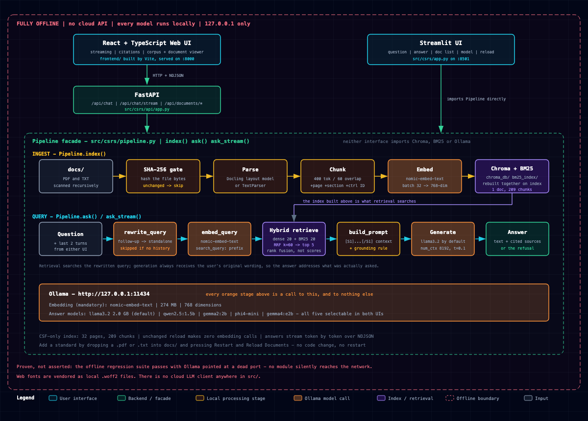
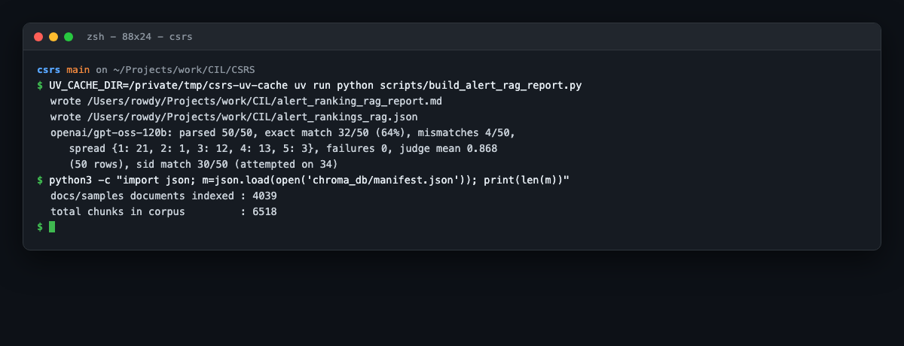
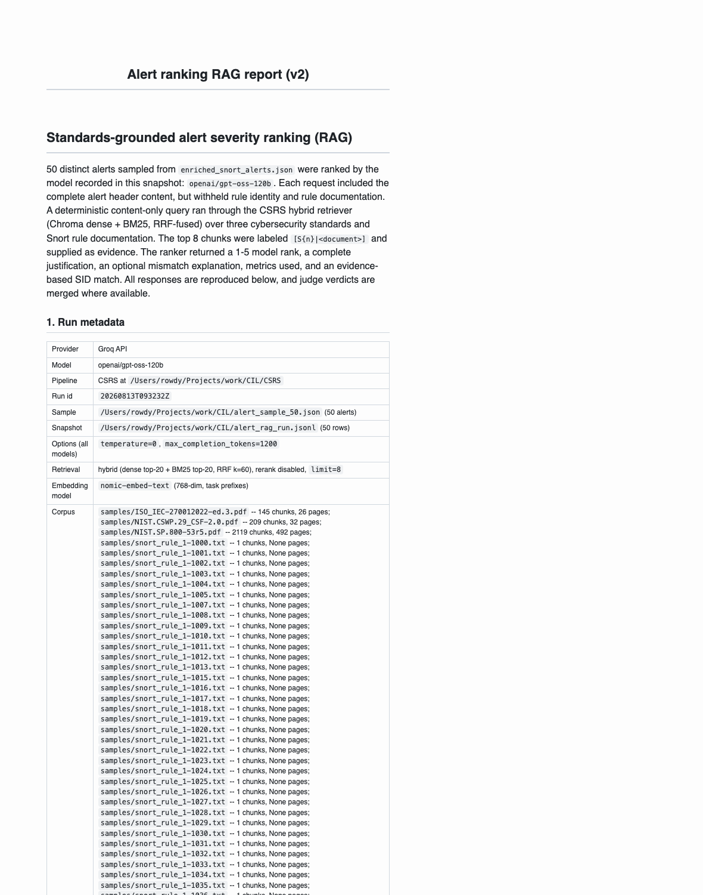
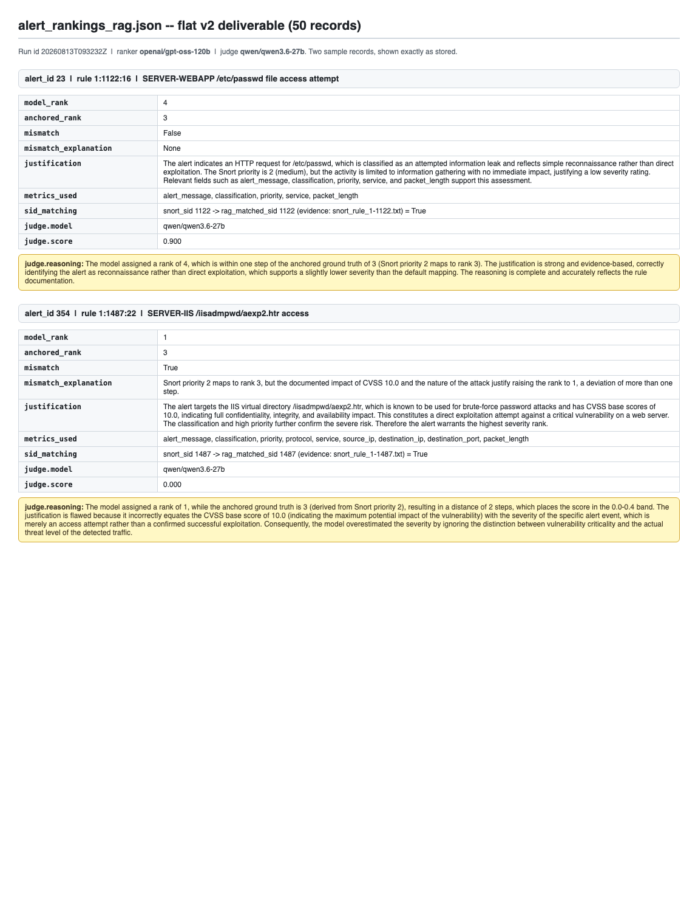

# CSRS Project Work History

## Overview

I built CSRS, a local retrieval-augmented generation system for cybersecurity standards,
between July 21 and August 21, 2026. This snapshot covers the product-work history from
`603d1a0` through `7272e68`: 117 linear commits by `subhan-17h`, with no merges. Across
those commits, Git records 46,613 text-line insertions and 8,579 deletions. The 32-day
span contains 16 working days.

The project grew from a Python walking skeleton into a page-aware document pipeline with
hybrid retrieval, grounded Ollama generation, Streamlit and React interfaces, and a
50-question evaluation across five local models. After that evaluation I extended the same
pipeline into an alert-severity ranking experiment: 50 real Snort alerts ranked against a
retrieval corpus of three cybersecurity standards plus the Snort community ruleset -- first
as 4,022 one-line rules, finally as 4,017 documents rendered from the published rule
documentation -- with an independent LLM judge. The evaluation corpus is NIST Cybersecurity
Framework 2.0, indexed as 209 chunks from 32 pages; the experiment corpus adds ISO 27001,
NIST SP 800-53r5, and the Snort ruleset.

## How this record was verified

This history uses the canonical Git log and each commit's message, changed files, and diff.
Implementation claims were checked against the current source, tests, manifests, and final
evaluation artifacts. The original [specification](CSRS.md), [roadmap](ROADMAP.md),
[research](RESEARCH.md), [task record](../tasks/todo.md), and
[lessons](../tasks/lessons.md) provide context, but planned or superseded work is not
presented as current functionality.

This revision extends the record through `7272e68`. The alert-ranking claims were
re-checked against the published report, the flat JSON deliverable, the two run snapshots,
and the corpus manifest in `chroma_db/manifest.json`.

Commits made after `7272e68` prepare this submission itself (the `SUB` phase) and are not
counted as product work; the ledger below therefore ends at `7272e68`.

The day-by-day section adds three working days that Git does not record, each evidenced by
the artifact it produced: the alert dataset (July 30), the rule-documentation scraping
session (July 31), and the severity rubric (August 3). Weekday dates with neither commits
nor artifacts are shown as research days and describe only work anchored to documents in
this repository; no activity is claimed for which no evidence exists. Weekend dates are
omitted.

Commit timestamps show when work was recorded, not the hours spent. The alert-phase
deliverables live outside the repository (under `~/Projects/work/CIL/`) and are cited as
evidence rather than committed. The evaluation report files (`eval/final/summary.csv`,
`RAG_Evaluation_Report.pdf`, `results.md`) are committed as project artifacts. The full
history, including the 32 commits after `ef4736b`, is committed on `main` and pushed to
`origin/main`.

## Work by day

The internship ran from Tuesday 21 July to Friday 21 August 2026: a 32-day span containing
**16 working days**. Of the 16 remaining dates, 14 are weekend days and 9 are weekdays
spent on background research and result analysis rather than on committed work. Working
days are numbered Day 1 to Day 16 and carry their commit evidence; research days name the
documents they drew on and the shipped work they prepared for. Weekends are not listed.

### Day 1 — Tuesday 21 July: foundation and first working RAG

I established the specification, research, roadmap, Python 3.12 `uv` project, corpus
workflow, and typed settings. I then completed the first end-to-end path: loaders,
recursive chunking, prefixed Ollama embeddings, Chroma storage, grounded generation, a
pipeline facade, and a minimal Streamlit UI. The day ended with page-preserving PDF
parsing, boilerplate removal, and hierarchy-aware chunks.

**23 commits (`603d1a0`..`85a7735`); +10,212 / -1,101 lines.**

### Day 2 — Wednesday 22 July: production ingestion and web application

I replaced the growing PDF heuristics with Docling, added model warming for offline use,
and used Docling headings in chunk metadata. Content hashes made unchanged indexing fast,
while model selection, reload controls, and runtime settings completed the Streamlit
requirements. I then added FastAPI endpoints and began a React interface with grounded
citations and streamed retrieval progress.

**18 commits (`0e45c98`..`5fa2356`); +10,629 / -426 lines.**

### Day 3 — Thursday 23 July: frontend completion and hardening

I completed token streaming, application settings, the corpus explorer, and local browser
conversation history. I documented and visually verified both interfaces, fixed corrupt
history handling so one bad conversation could not erase the rest, documented process
shutdown, and introduced the first 48-question retrieval golden set.

**11 commits (`5447b3b`..`d7b63ad`); +3,399 / -255 lines.**

### Day 4 — Friday 24 July: retrieval quality, conversation context, and submission

I added retrieval metrics, persisted BM25 search, reciprocal-rank fusion, and optional
FlashRank reranking. Measurements showed that the original Recall@10 and nDCG@10 targets
rewarded duplicate control chunks, so I corrected the evaluation focus and made hybrid
retrieval the default. I also added conversational query rewriting, original-document
viewing, licensing, submission documentation, and a final live-application audit.

**22 commits (`9d1dbf7`..`8bc07fc`); +5,380 / -796 lines.**

### Research day — Monday 27 July: evaluation method and retrieval-improvement reading

With the submission closed, I read on how retrieval quality is measured and improved
before committing to an evaluation design. The evidence base I had assembled in
[RESEARCH.md](RESEARCH.md) covers the relevant ground: §2 on dense, BM25 and
reciprocal-rank fusion, §3 on reranking including the correction that Ollama exposes no
reranking endpoint, and §7 on evaluation, where I recorded the decision to measure
retrieval directly rather than rely on an LLM judge alone. §4 documents the advanced
architectures I evaluated and declined — HyDE, multi-query expansion, step-back prompting,
late chunking, proposition-based chunking and CRAG — each with the reason it did not suit
a local, CPU-bound, single-corpus system. This reading set the shape of the three-layer
harness committed the next day.

### Day 5 — Tuesday 28 July: evidence-grounded answer evaluation

I replaced the legacy retrieval-only harness with EVAL-2: 20 readable questions over four
documents, cosine similarity, retrieval evidence coverage, and an optional structured
Groq GPT-OSS judge. The completed two-model run established an answer-quality baseline.

**1 commit (`3410a46`); +4,177 / -1,856 lines.**

### Day 6 — Wednesday 29 July: CSF-only five-model evaluation

I reduced the durable corpus to CSF 2.0 and created 50 new evidence-grounded questions.
EVAL-3 added CPU BERTScore alongside cosine similarity and the GPT-OSS judge, compared all
five installed Ollama models, and produced detailed resumable reports. I corrected
non-atomic benchmark claims, made quota-window resumes safe, normalized CSV output, and
published a complete 250-row run with no technical errors. The same day I wrote and
verified the first version of this work record (HIST-1), establishing the canonical
chronology.

**13 commits (`99b9cb1`..`f61d807`); +5,218 / -3,279 lines.**

### Day 7 — Thursday 30 July: Snort alert dataset preparation

I prepared the intrusion-alert dataset the second half of the internship would use,
producing `enriched_snort_alerts.json` (2.7 MB) under `~/Projects/work/CIL/`. This work
predates the ranking code and is recorded by the artifact rather than by a commit: the
alert corpus had to exist before a ranking task could be defined over it.

**Evidence: `enriched_snort_alerts.json`, written 2026-07-30.**

### Day 8 — Friday 31 July: rule-documentation scraping session

I collected Snort rule documentation from snort.org through a scripted browser session,
which left 16 artifacts under `.playwright-mcp/`: three console logs, nine page snapshots
(37-76 KB each) and four screenshots. This established what the published rule
documentation contains — rule category, alert message, rule explanation, properties, CVE
and references — the fields that ALERT-RAG-8 would later render into the corpus on Day 16.

**Evidence: 16 files under `.playwright-mcp/`, written 2026-07-31.**

### Day 9 — Monday 3 August: the alert-severity criteria

I wrote `cretria.md`, the nine-criterion rubric that defines what "severity" means for
this experiment: potential impact, attack type and vector, likelihood of success, level of
access, sensitive-data exposure, Snort priority, alert context, ease of mitigation, and
alert frequency. Each criterion is stated in plain language, illustrated with a real Snort
example, and given a correct interpretation — including the traps: that Snort priority is
"only a starting clue", and that alert frequency "measures volume, not danger". This
document is the conceptual foundation of every ranking run that follows.

**Evidence: `cretria.md`, written 2026-08-03.**

### Research days — Tuesday 4 and Wednesday 5 August: severity semantics and task design

I worked through how the rubric of Day 9 could become a machine-checkable task. The open
questions were what ground truth to grade against, given that no human severity labels
existed for these 50 alerts, and how to keep the model from simply copying the visible
`priority` field. The resolution recorded in `cretria.md` — that Snort priority is a
starting clue rather than an answer — became the anchor mapping committed on Day 11, and
the sampling and prompt design became the runner committed on Day 10.

### Day 10 — Thursday 6 August: alert-ranking RAG foundation

I re-purposed the pipeline for a new task: rank the severity of 50 real Snort intrusion
alerts using retrieved standards evidence. I fetched NIST SP 800-53r5 alongside CSF 2.0,
made the evaluation manifest tolerate a superset corpus, and built the ranking runner and
its report builder.

**5 commits (`84fab52`..`905eb5e`); +1,174 / -13 lines.**

### Research day — Friday 7 August: judge design and the mismatch rule

Before writing the grading code I settled how a ranking would be scored. Two decisions
came out of it, both committed on Day 11: mapping Snort's 1-3 priority onto anchors 1, 3
and 5 on the five-point scale, and treating a rank as a mismatch only when it lies more
than one step from its anchor, so that defensible refinement is not punished as error.
[RESEARCH.md](RESEARCH.md) §7 records the general position this rests on — that a judge
supplements measurement rather than replacing it.

### Day 11 — Monday 10 August: mismatch and judge passes

I defined the shared Snort-priority-to-rank anchor (1 -> 1, 2 -> 3, 3 -> 5) with a
one-step mismatch rule, added a mismatch-justification pass and a GPT-OSS severity judge,
and merged both verdicts into the report deliverables.

**4 commits (`1d47a97`..`5f44b8e`); +966 / -11 lines.**

### Day 12 — Tuesday 11 August: Groq migration

I moved the whole experiment chain (rank, justify, judge) from local Ollama models to
`openai/gpt-oss-120b` through Groq, adding a shared transport with sliding-window rate
limiting and daily-quota-safe resumes. A smoke run surfaced that gpt-oss-120b emits
nothing without `reasoning_effort`, which I fixed.

**6 commits (`407e8b8`..`b1b3d6b`); +1,155 / -207 lines.**

### Day 13 — Wednesday 12 August: v1 production run

The multi-day production run completed quota-safe. This first full run ranked 50/50 with
21 exact matches (42%), self-judged at a mean of 0.586.

**1 commit (`bb84dbc`); +10 / -1 lines.**

### Day 14 — Thursday 13 August: v2 — split models, clean JSON, full-ruleset SID matching

I delivered the v2 experiment: a clean one-line JSON contract with `model_rank`, complete
justifications and mismatch explanations written in the ranker's single call (justify pass
retired), an independent `qwen/qwen3.6-27b` judge instead of self-judgment, the answer key
(rule identity and rule documentation) withheld from the ranker, evidence-labeled SID
matching, and the full Snort community ruleset ingested as per-rule documents. The final
run improved exact matches from 21 to 32 of 50 and cut mismatches from 23 to 4.

**8 commits (`918f661`..`3725ade`); +1,536 / -613 lines.**

### Research day — Friday 14 August: v2 result analysis

I worked through the v2 outcome recorded in the ALERT-GROQ-7 review section of
[tasks/todo.md](../tasks/todo.md). Ranking had improved substantially, but SID matching had
not: 16 of 50 alerts produced no rule evidence in the top-8 chunks, and 4 of the 34
attempted matches were wrong, all of them alerts sharing the generic "SERVER-WEBAPP /....
access" message. The conclusion — that the one-line community-rule documents carried too
little text to disambiguate — is what the corpus swap on Day 16 acted on.

### Day 15 — Saturday 15 August: work record and evaluation artifacts

I completed the verified work history through alert-ranking v2 (HIST-2), committed the
evaluation summary and report artifacts, and built the LaTeX internship work record with
its figure pipeline (PDF-1): `make_figures.py`, `make_excerpts.py`, `make_screenshots.py`
and `build.sh`, producing `CSRS_Work_Record.pdf`.

**3 commits (`4b5154f`..`9e3b0df`); +2,017 / -20 lines.**

### Research days — Monday 17 to Thursday 20 August: corpus quality investigation

Acting on the Day 14 diagnosis, I examined what the indexed rule documents actually
contained and what richer source was available. The one-line community rules gave the
retriever almost nothing to match a generic alert message against, while the snort.org
documentation collected on Day 8 carried rule category, alert message, rule explanation,
properties, CVE identifiers and references. Preparing that source as
`rule_docs_preprocessed_by_sid.json` — 4,017 records keyed by SID, of which 3,945 carry
the full documentation fields — is what made the Day 16 rebuild possible. The design
constraint identified here proved decisive: the filename convention
`snort_rule_1-<sid>.txt` had to stay unchanged, because the ranker prompt reads the SID out
of the document name.

### Day 16 — Friday 21 August: v3 — the detailed rule corpus

I replaced the 4,022 one-line community-rule documents and the 14 scraped rule-doc pages
with 4,017 detailed documents rendered by a new `scripts/build_snort_rule_docs.py`, then
re-indexed and re-ran rank -> judge -> report. Rule identification improved to its
retrieval ceiling: SID matching went from 30 correct / 4 wrong / 16 not attempted to 40
correct / 0 wrong / 10 abstained. Severity ranking regressed: exact matches fell from
32/50 to 29/50 and the judge mean from 0.868 to 0.780. I archived the superseded v1 and v2
artifacts and the short-form corpus, and closed the phase with the measured outcome rather
than a tuned one.

**2 commits (`57a2a8f`..`7272e68`); +505 / -1 lines.**

## Major implementation stages

| Stage | Result |
|---|---|
| Foundation | Specification, research, configuration, corpus workflow, and typed contracts. |
| Local RAG | Page-aware loading, structured chunks, Ollama embeddings and generation, and Chroma persistence. |
| Retrieval quality | Incremental indexing, BM25 plus dense RRF, optional reranking, and query rewriting. |
| Interfaces | Streamlit for the required UI; FastAPI and React for streaming chat and corpus browsing. |
| Evaluation | Legacy retrieval checks evolved into EVAL-2 and then the CSF-only, three-metric EVAL-3 benchmark. |
| Alert ranking | The same hybrid retriever grounds 50 real Snort alert severity rankings, judged by an independent model, on a corpus expanded to three standards plus the 4,022-rule Snort community ruleset. |

## Verified current implementation

- **Ingestion and indexing:** the PDF [loaders](../src/csrs/loaders/) preserve page
  boundaries, with Docling as the default parser. [Chunking](../src/csrs/chunking.py)
  propagates recognized headings and control identifiers. Content-hash indexing stores
  embeddings in Chroma and keeps the persisted BM25 index synchronized.
- **Retrieval and generation:** the [pipeline](../src/csrs/pipeline.py) can rewrite a
  follow-up using the last two turns, combine dense and BM25 rankings with reciprocal-rank
  fusion, optionally rerank, and send the top evidence to a local Ollama model. FlashRank
  is implemented but disabled by default.
- **Interfaces:** [Streamlit](../src/csrs/app.py) provides the required local interface.
  The [FastAPI service](../src/csrs/api/app.py) and [React frontend](../frontend/src/)
  add streamed answers, source cards, settings, conversation history, corpus browsing,
  and original-document viewing.
- **Operating boundary:** production ingestion, retrieval, and generation run locally
  after model warming. Groq is used by the opt-in evaluation judge and by the alert-ranking
  experiment's ranker and judge.
- **Alert ranking:** [run_alert_rag.py](../scripts/run_alert_rag.py) ranks 50 real Snort
  alerts from retrieved evidence; [judge_alert_rankings.py](../scripts/judge_alert_rankings.py)
  scores each ranking with an independent model; [build_alert_rag_report.py](../scripts/build_alert_rag_report.py)
  emits the flat JSON and Markdown deliverables; and [groq_llm.py](../scripts/groq_llm.py)
  is the shared quota-safe transport.

The EVAL-3 snapshot passed the 50-question dataset validator, 269 offline tests
(2 deselected), Ruff, and the frontend production build. The final CSV contains 250 rows,
50 per model, with all three metrics and no technical errors. After the alert phase the
full offline suite stands at 339 tests (markers `not ollama and not docling`), with Ruff
clean.

## Evaluation outcome

The final [EVAL-3 report](../eval/final/report.md) contains 250 complete question-model
rows with no technical errors. Each answer was scored independently by cosine similarity
(pass threshold 0.75), raw RoBERTa-large BERTScore F1 (pass threshold 0.85), and the
temperature-zero `openai/gpt-oss-120b` judge.

| Model | Mean cosine | Cosine pass | Mean BERTScore F1 | BERTScore pass | Judge pass |
|---|---:|---:|---:|---:|---:|
| `gemma2:2b` | 0.848 | 82% | 0.910 | 100% | 90% |
| `gemma4:e2b` | 0.840 | 76% | 0.905 | 98% | 82% |
| `llama3.2:latest` | 0.817 | 74% | 0.887 | 96% | 76% |
| `phi4-mini:latest` | 0.802 | 64% | 0.878 | 86% | 50% |
| `qwen2.5:1.5b` | 0.785 | 48% | 0.883 | 90% | 44% |

`gemma2:2b` led all three measures in this run. The metrics remain separate; the project
does not combine them into an overall score.

## Alert-ranking experiment outcome

The experiment ranks the severity of 50 real Snort alerts on a 1-5 scale (1 = most
severe) with the CSRS hybrid retriever supplying evidence, then an independent model
judges each ranking. Ground truth is Snort's own 1-3 priority mapped to anchors 1, 3 and
5; a rank is a mismatch when it is more than one step from its anchor. The ranker sees the
alert header content but not the rule identity or rule documentation, so correct SID
matches must come from retrieved evidence. Two production runs are directly comparable
(the same 50 alerts throughout):

| Run | Ranker | Judge | Corpus | Parsed | Exact | Mismatches | Judge mean |
|---|---|---|---|---|---:|---:|---:|
| v1 (Aug 12) | `openai/gpt-oss-120b` | same model (self-judged) | 3 standards | 50/50 | 21/50 (42%) | 23/50 | 0.586 |
| v2 (Aug 13) | `openai/gpt-oss-120b` | `qwen/qwen3.6-27b` | + 4,022 one-line rules | 50/50 | 32/50 (64%) | 4/50 | 0.868 |
| v3 (Aug 21) | `openai/gpt-oss-120b` | `qwen/qwen3.6-27b` | + 4,017 detailed rule docs | 50/50 | 29/50 (58%) | 9/50 | 0.780 |

The v1 prompt mapped Snort priority straight onto the 5-point scale, which produced 23
mismatches; v2 restored independent ranking ("treat the mapped rank as a starting point
only ... REFINE when evidence warrants"), cutting mismatches to 4. The v2 rank spread is
1->21, 2->1, 3->12, 4->13, 5->3. All four CVSS-10.0 spot-checks were ranked 1. The judge
(mean 0.868, median 1.000) uses rubric bands of 1.0 exact, 0.5-0.9 within one step, and
0.0-0.4 beyond, and also grades justification completeness.

SID matching in v2: 30 of 34 attempted matches were correct (16 alerts had no rule
evidence in the top-8 chunks, so no SID comparison was possible); the 4 wrong matches are
all sid-1142 alerts whose generic shared message surfaces other rules -- a documented
retrieval-ambiguity limitation.

### v3: what the detailed corpus changed

v3 replaced the one-line community-rule documents with 4,017 documents rendered from the
snort.org rule documentation, taking the index from 4,039 documents / 6,518 chunks to
4,020 / 9,642. The two effects separate cleanly.

**Rule identification reached its retrieval ceiling.** SID matching went from 30 correct /
4 wrong / 16 not attempted to **40 correct / 0 wrong / 10 abstained**. A pre-flight
retrieval check showed the true SID is reachable in the top-8 for exactly 40 of the 50
alerts, so the ranker hit that ceiling precisely and never guessed beyond it. Each of the
10 abstentions had 8 rule documents in evidence and correctly declined; 9 are the generic
"SERVER-WEBAPP /.... access" (sid 1142) and 1 is sid 966. The retrieval ambiguity of v2 is
unchanged, but it now surfaces as abstention rather than as a wrong answer.

**Severity ranking regressed, and the regression is real.** Exact matches fell from 32/50
(64%) to 29/50 (58%) and mismatches rose from 4 to 9. Judge scores by distance from the
anchor make the cause legible:

| \|model_rank - anchored_rank\| | n | Mean judge score |
|---|---:|---:|
| 0 | 29 | 1.00 |
| 1 | 12 | 0.78 |
| 2 | 9 | 0.08 |

The judge sees ground truth and rejects nearly every two-step departure -- seven of the
nine score a flat zero. These are therefore not defensible refinements. With
`rule_explanation` and CVE text now in the evidence, the ranker over-weights narrative
severity ("CVSS 10.0", "complete compromise") against the Snort priority. The prompt's
"REFINE when evidence warrants" latitude was chosen when the evidence was a single line of
rule code; it is the prime suspect and the identified next experiment. It has deliberately
not been run, so that this record reports a measured outcome rather than a tuned one.

## Evidence and deliverables

The alert-phase artifacts under `/Users/rowdy/Projects/work/CIL/` are the machine-generated
proof of the work and can be re-verified or regenerated:

| Artifact | What it proves |
|---|---|
| `alert_rankings_rag.json` | Flat 50-record v3 deliverable: `model_rank`, justification, `anchored_rank`, mismatch + explanation, `sid_matching`, and judge verdict per alert. |
| `alert_ranking_rag_report.md` | Full v3 report: prompt verbatim, all 50 model responses verbatim, confusion table, evidence statistics, mismatch analysis, judge scores, and caveats. |
| `alert_rag_run.jsonl` (run `20260821T100923Z`) | Ranker snapshot: every request, attempt, retrieved evidence, and parse outcome. |
| `alert_judge_run.jsonl` | Judge snapshot: every verdict with score and reasoning. |
| `archived/` | The superseded v1 and v2 deliverables, run snapshots and the short-form corpus, preserved for comparison. |
| `chroma_db/manifest.json` | Indexed experiment corpus: 4,020 documents / 9,642 chunks. |
| Git log `main` (117 commits) | Provenance: every change is a separate, dated, verified commit. |
| `assets/architecture.svg` | The system architecture diagram (rendered above). |

Screenshots of the deliverables themselves (regenerated and verified for this record):

Reproduce or re-verify from the repository:

- `uv run --group eval python -m pytest -q -m "not ollama and not docling"` -- 339 passed.
- `python scripts/build_alert_rag_report.py` -- regenerates both deliverables.
- `python scripts/run_alert_rag.py --resume --top-k 8` and
  `python scripts/judge_alert_rankings.py --resume` -- report 50/50 already complete with
  zero new API calls.

## Important corrections and lessons

- Repeated PDF-cleaning heuristics led to adopting Docling rather than adding more rules.
- The initial retrieval target rewarded repeated chunks from one control. Re-baselining
  on rank-one relevance and Recall@5 made hybrid retrieval measurable and defensible.
- Candidate-pool size and generation-context size are different; only the final top
  evidence should consume the LLM context window.
- EVAL-2 proved the end-to-end method, while EVAL-3 replaced it with the final
  one-document, 50-question, five-model benchmark.
- Verification against the running system repeatedly corrected documentation that source
  inspection alone had made look complete.
- A model judging its own rankings is biased; splitting the ranker and judge across model
  families lifted the mean judge score from 0.586 to 0.868 and exposed real errors.
- A separate justification pass meant a third API call and stale snapshots; folding the
  mismatch explanation into the ranker's single JSON call retired it cleanly.
- Hosted-model contracts differ: gpt-oss-120b needs `reasoning_effort` to emit content,
  while qwen rejects `"low"` and thinking mode breaks `json_object`. Request options must
  be gated per model.
- A small corpus makes matching tests trivial. The 14-document SID test passed 50/50; the
  full 4,022-rule corpus exposed genuine retrieval ambiguity, because dozens of community
  rules share generic messages such as "SERVER-WEBAPP /.... access".
- Richer evidence is not uniformly better. Replacing one-line rules with full rule
  documentation drove SID matching to its retrieval ceiling and simultaneously degraded
  severity ranking, because the added CVE and explanation text gave the ranker narrative
  severity cues that outweighed the Snort priority. An evidence change must be measured on
  every metric it can touch, not only the one it targets.
- Grading by distance from ground truth, rather than by pass or fail, is what made the
  regression diagnosable: the flat 0.08 mean at two steps distinguished over-reach from
  refinement, which a single accuracy figure would have hidden.

## Current limitations

- The benchmark contains answerable, single-turn CSF questions and remains marked `draft`
  until its semantic claims receive human review. It does not test unanswerable questions,
  multi-document generalization, calibrated thresholds, or fixed retrieval context, so
  end-to-end scores combine retrieval and generation effects.
- Conversation rewriting is shallow, absent from Streamlit, and not evaluated.
- Sources identify retrieved pages and sections; they are not inline claim-level
  citations. Refusal detection still relies on a fixed response string.
- Parent-child expansion and a confidence-gated refusal threshold were planned but not
  implemented. The optional reranker ships disabled.
- In the alert experiment, the priority-3 sample is only 3 alerts from one rule; exact
  matches can partly reflect the visible `priority` field; retrieval is
  query-vocabulary dependent (ISO Annex A control ids are not parsed); and SID matching is
  retrieval-limited -- 16 of 50 alerts had no rule evidence in the top-8 chunks. The
  comparison against the earlier non-RAG run remains skipped because `alert_rankings.json`
  is no longer present.

## Complete commit ledger

The ledger below accounts for every product-work commit through `3725ade`. Diff totals
above are computed from these commits; unreachable rewrite, amend, and stash objects are
not separate delivered changes. All 112 commits are pushed to `origin/main` and linked to
their remote commits.

| Date | Commit | Subject | Verified effect |
|---|---|---|---|
| 2026-07-21 | [`603d1a0`](https://github.com/subhan-17h/CSRS/commit/603d1a09be49836d86ab64367f27f68f9bdf87db) | chore: initialise repository with spec and planning artefacts | Added the specification, research, roadmap, and repository guidance. |
| 2026-07-21 | [`d50914a`](https://github.com/subhan-17h/CSRS/commit/d50914a9881b05d0e95195d0f60e07fe130c37de) | chore(T-0.1): scaffold uv project on Python 3.12 | Created the Python package, dependencies, and lockfile. |
| 2026-07-21 | [`f883f1c`](https://github.com/subhan-17h/CSRS/commit/f883f1c4488fe69e6f7721dfb2b8daf573d2b4b7) | feat(T-0.3): add corpus fetch script and public-domain sample | Added the standards fetcher and initial text sample. |
| 2026-07-21 | [`5dad583`](https://github.com/subhan-17h/CSRS/commit/5dad583d62155206f28fcba91df590d782ee1608) | feat(T-0.4): add typed settings module | Centralized runtime settings with typed environment configuration. |
| 2026-07-21 | [`78a3884`](https://github.com/subhan-17h/CSRS/commit/78a3884f287050774b3eae7a0da859bfc90cd6cf) | docs(phase 0): close Phase 0 -- environment, models and corpus verified | Recorded verified Phase 0 completion evidence. |
| 2026-07-21 | [`e5c620d`](https://github.com/subhan-17h/CSRS/commit/e5c620d9e5e50918ecbfdd1bf8cffeea39988d13) | feat(T-0.4): default to llama3.2 rather than qwen2.5:1.5b | Changed the default chat model to Llama 3.2. |
| 2026-07-21 | [`68a94ab`](https://github.com/subhan-17h/CSRS/commit/68a94abafa4bba0e92a9721fde76a56261ba5c2d) | feat(T-0.3): ship one PDF and one TXT sample, each a different standard | Added NIST PDF and OWASP text samples. |
| 2026-07-21 | [`3d70c34`](https://github.com/subhan-17h/CSRS/commit/3d70c345402b7538eee893242c2450cfd314757f) | docs: forbid attribution trailers in commit messages | Recorded the repository ban on attribution trailers. |
| 2026-07-21 | [`67a9f21`](https://github.com/subhan-17h/CSRS/commit/67a9f21329388ba858f0859b7f52d5ddfce5fe80) | feat(T-1.1): add the data models every module exchanges | Defined shared document, chunk, retrieval, and answer models. |
| 2026-07-21 | [`bba6ec5`](https://github.com/subhan-17h/CSRS/commit/bba6ec5eebdcf6f93470fb4733f6be49d101632c) | docs: require a watcher on every Codex task | Added mandatory watcher workflow guidance and its lesson. |
| 2026-07-21 | [`436e267`](https://github.com/subhan-17h/CSRS/commit/436e2673b61e78b030658915232ffba7ffd74dd5) | feat(T-1.2): add DocumentParser protocol, TXT loader and registry | Implemented the parser protocol, registry, and TXT loader. |
| 2026-07-21 | [`09085e2`](https://github.com/subhan-17h/CSRS/commit/09085e2133908930be148510f7bd1d7d7f53a95e) | docs: make Codex keep tasks/todo.md current, and pin its constraints | Made task tracking and repository constraints explicit. |
| 2026-07-21 | [`5e0ab5f`](https://github.com/subhan-17h/CSRS/commit/5e0ab5fa5dec28dcc15ac54493007d4ed7956648) | feat(T-1.3): add naive recursive chunker with real text overlap | Implemented recursive chunking with tested overlap. |
| 2026-07-21 | [`647b16e`](https://github.com/subhan-17h/CSRS/commit/647b16e02c12a5157ddf07f06d4590eeeeeb3468) | docs: identify the Codex job before attaching a watcher | Required watcher setup to identify the active job. |
| 2026-07-21 | [`ce02e1f`](https://github.com/subhan-17h/CSRS/commit/ce02e1fcc4a490e7d324e9e9097a851a4cbccf9b) | feat(T-1.4): embed via Ollama with the mandatory nomic task prefixes | Implemented Ollama embeddings with Nomic task prefixes. |
| 2026-07-21 | [`16ee54a`](https://github.com/subhan-17h/CSRS/commit/16ee54ab6955925b1da16a3787a05bc56588306e) | feat(T-1.5): persist chunks in Chroma with cosine space and our own vectors | Persisted external embeddings and chunks in cosine Chroma. |
| 2026-07-21 | [`72a1843`](https://github.com/subhan-17h/CSRS/commit/72a1843a4e3d6a18c9e60e17175bf3244c293eba) | feat(T-1.6): generate grounded answers with a literal refusal string | Added grounded generation, sources, and refusal behavior. |
| 2026-07-21 | [`2a5f0a6`](https://github.com/subhan-17h/CSRS/commit/2a5f0a609c43f86347c9a12e47c20b2a464f93a2) | feat(T-1.7): add the Pipeline facade the UI and eval harness both drive | Introduced the shared indexing and query pipeline. |
| 2026-07-21 | [`e4e32a1`](https://github.com/subhan-17h/CSRS/commit/e4e32a1bd63c2bc19316f6635e7b9634af9ca803) | feat(T-1.8): add the minimal Streamlit app that closes the loop | Added the initial end-to-end Streamlit interface. |
| 2026-07-21 | [`fd56a5f`](https://github.com/subhan-17h/CSRS/commit/fd56a5fb2e15eb319ba34f32a91220c8a626017b) | docs(phase 1): close Phase 1 with the checkpoint findings | Recorded verified Phase 1 checkpoint results. |
| 2026-07-21 | [`f861318`](https://github.com/subhan-17h/CSRS/commit/f8613180a9ac6114ac8fd5d015a723236fe1b437) | feat(T-2.1): parse PDFs into page-preserving documents | Added page-preserving PDF parsing and tests. |
| 2026-07-21 | [`061ef52`](https://github.com/subhan-17h/CSRS/commit/061ef5258c266c25f6915f05050e6a880394d0b0) | fix(T-2.1): strip running boilerplate the full corpus actually has | Removed recurring PDF headers and footers. |
| 2026-07-21 | [`85a7735`](https://github.com/subhan-17h/CSRS/commit/85a773513638d7bff1cc1005f76728acc2d19f66) | feat(T-2.2): split on control boundaries and embed hierarchy breadcrumbs | Added control-boundary chunking and hierarchy breadcrumbs. |
| 2026-07-22 | [`0e45c98`](https://github.com/subhan-17h/CSRS/commit/0e45c98aa0027c3c3131d271341e8593798d3e42) | feat(T-2.7): add Docling as the default PDF parser behind config | Made configurable Docling parsing the PDF default. |
| 2026-07-22 | [`fee4fe7`](https://github.com/subhan-17h/CSRS/commit/fee4fe7aaabd7e8fa1891d322cf68a8108a08fc1) | feat(T-2.7): drive chunk hierarchy from Docling's Markdown headings | Derived chunk hierarchy from Docling headings. |
| 2026-07-22 | [`cb16167`](https://github.com/subhan-17h/CSRS/commit/cb1616731ff48f48dd81fc0f008f8804df0e9a72) | feat(T-2.7): add warm_models.py so offline operation is a setup step | Added model prewarming for offline operation. |
| 2026-07-22 | [`acf112a`](https://github.com/subhan-17h/CSRS/commit/acf112a8bb00815c67310580ce0fedb7e0d91597) | docs(T-2.7): make Docling a core dependency and correct the record | Promoted Docling to core and corrected planning records. |
| 2026-07-22 | [`b773947`](https://github.com/subhan-17h/CSRS/commit/b7739475ab1cd78fe91c6a7c0db0c9b9efc3f9d7) | feat(T-2.3): skip unchanged files before parsing them | Skipped unchanged files using persisted fingerprints. |
| 2026-07-22 | [`763dd60`](https://github.com/subhan-17h/CSRS/commit/763dd60eca79f60d6258d7973b8ff11f8a757634) | feat(T-2.4): populate the model selector from installed Ollama models | Populated model selection from live Ollama inventory. |
| 2026-07-22 | [`2e0173e`](https://github.com/subhan-17h/CSRS/commit/2e0173ed5a0643b421fc06a9b63d52616dae976e) | feat(T-2.5): add reload controls and a persisted document summary | Added reload controls and persisted document summaries. |
| 2026-07-22 | [`9b6f4dc`](https://github.com/subhan-17h/CSRS/commit/9b6f4dcdc0326525bb7142951a73215b60ab61ee) | feat(T-2.6): surface application settings in the sidebar | Exposed generation and retrieval settings in Streamlit. |
| 2026-07-22 | [`fc5fcb6`](https://github.com/subhan-17h/CSRS/commit/fc5fcb699479ed9e0f56dec92a92c66a8b4790ca) | fix(T-2.6): send rerank_top_n chunks to generation, not the whole pool | Limited generation context to the top chunks. |
| 2026-07-22 | [`a70abe0`](https://github.com/subhan-17h/CSRS/commit/a70abe06584dc915cc85431939688e43f3a8acfc) | phase(2): record the CSRS.md 1-6 checkpoint and close Phase 2 | Recorded verified Phase 2 completion evidence. |
| 2026-07-22 | [`32b5bfd`](https://github.com/subhan-17h/CSRS/commit/32b5bfdc9379d3c86cef2219c3e3a8dbc60312a6) | docs(T-6.1): write the submission README and the engineering narrative | Added the submission README and engineering narrative. |
| 2026-07-22 | [`5d0c2ad`](https://github.com/subhan-17h/CSRS/commit/5d0c2ad562e5d608963a0fde0f6bf080ed0f2a5f) | feat(T-7.1): add the FastAPI layer with read-only pipeline endpoints | Added lazy health, documents, and models endpoints. |
| 2026-07-22 | [`a3f674e`](https://github.com/subhan-17h/CSRS/commit/a3f674e37db747fd169c032e57af5a720f0ed4a5) | feat(T-7.2): answer questions over HTTP and serialize grounded citations | Added HTTP answers with grounded source serialization. |
| 2026-07-22 | [`a728cdb`](https://github.com/subhan-17h/CSRS/commit/a728cdb6532aa6ec5bef9fb474992532c7da25e3) | feat(T-7.3): stream answers with real retrieval stages over NDJSON | Streamed retrieval stages and answers over NDJSON. |
| 2026-07-22 | [`523223e`](https://github.com/subhan-17h/CSRS/commit/523223e45607df43d1d600841fcb67b7040bd6ab) | feat(T-7.4): reload and rebuild the index over streaming NDJSON endpoints | Added streamed reload and full rebuild endpoints. |
| 2026-07-22 | [`abda8ed`](https://github.com/subhan-17h/CSRS/commit/abda8ed0ddeee46700c01b30cd0f17e7911ed588) | feat(T-7.5): browse document chunks and serve the built frontend | Added chunk browsing and built-frontend serving. |
| 2026-07-22 | [`9d8363c`](https://github.com/subhan-17h/CSRS/commit/9d8363cf3faf952565f02ee7aafc8acb4a06c023) | feat(T-7.6): transplant the frontend onto the CSRS domain and rebrand | Added and rebranded the React TypeScript frontend. |
| 2026-07-22 | [`5fa2356`](https://github.com/subhan-17h/CSRS/commit/5fa23565ae11bbc43bbd80f4b35d23527470138f) | feat(T-7.7): render answers as markdown and citations as an expandable card | Rendered Markdown answers and expandable source cards. |
| 2026-07-23 | [`5447b3b`](https://github.com/subhan-17h/CSRS/commit/5447b3b8539be53adc2bb2b9514f3b8501296569) | feat(T-7.8): stream real tokens and live retrieval stages into the UI | Connected live tokens and retrieval stages to React. |
| 2026-07-23 | [`8d52f90`](https://github.com/subhan-17h/CSRS/commit/8d52f903053cea0c13e55dfa64b98c173c030e41) | feat(T-7.9): add the application settings sidebar with spec section 5 parity | Added the specification-parity settings sidebar. |
| 2026-07-23 | [`d3703c6`](https://github.com/subhan-17h/CSRS/commit/d3703c67f54e89fb774969f53ab7fef71379dd20) | feat(T-7.10): add a read-only Corpus Explorer for the indexed documents | Added a read-only indexed-corpus explorer. |
| 2026-07-23 | [`9f899e6`](https://github.com/subhan-17h/CSRS/commit/9f899e6391f3aece71d986119b12eff5d7d0009c) | feat(T-7.11): persist conversations in localStorage and list them in the sidebar | Persisted and listed conversations in localStorage. |
| 2026-07-23 | [`a57c0e6`](https://github.com/subhan-17h/CSRS/commit/a57c0e6eeb24606a1f0a3944c89bd28fb8ec5821) | docs(T-7.12): document both interfaces and prove the offline claim | Documented both interfaces and verified offline operation. |
| 2026-07-23 | [`462d9e9`](https://github.com/subhan-17h/CSRS/commit/462d9e9dd4238d9cb13f79e4982118cb97d9a550) | phase(7): close the web frontend phase | Recorded completion of the web frontend phase. |
| 2026-07-23 | [`b46a9fb`](https://github.com/subhan-17h/CSRS/commit/b46a9fb3191199f555a6b6e48a1a3e9523f0058f) | docs(T-7.12): record the human visual verification of both UIs | Recorded human visual verification of both interfaces. |
| 2026-07-23 | [`6479fc4`](https://github.com/subhan-17h/CSRS/commit/6479fc4f526ab5348c257076bee1e1fe7f2104f1) | fix(F-1): drop only the corrupt conversation, not the whole history | Isolated corrupt conversation deletion from valid history. |
| 2026-07-23 | [`88ec86b`](https://github.com/subhan-17h/CSRS/commit/88ec86b04cf1fe41b1895c20bd0495b7e6b46828) | docs(F-2): document stopping the processes and what it costs | Documented process shutdown and its consequences. |
| 2026-07-23 | [`3665a3d`](https://github.com/subhan-17h/CSRS/commit/3665a3dbb7797ba3d95433def4791ca28744acdb) | docs(L-6): require repo conventions to be quoted, not paraphrased | Recorded the lesson to quote repository rules exactly. |
| 2026-07-23 | [`d7b63ad`](https://github.com/subhan-17h/CSRS/commit/d7b63ad0f88458191e32c65defe343b8577459f6) | feat(T-3.1): add the evaluation golden set and its validator | Added the evaluation set and structural validator. |
| 2026-07-24 | [`9d1dbf7`](https://github.com/subhan-17h/CSRS/commit/9d1dbf7c75c65ce3ba34a0b90207dfebebcbc8e2) | docs(submission): add the instructor-facing submission document | Added the instructor-facing submission document. |
| 2026-07-24 | [`ef57d11`](https://github.com/subhan-17h/CSRS/commit/ef57d111acae29d4421e4ca9e18108b0273654e5) | docs(diagram): add the system architecture diagram | Added HTML and SVG architecture diagrams. |
| 2026-07-24 | [`f5315fe`](https://github.com/subhan-17h/CSRS/commit/f5315fe2d29527942506582cd20a8449f18c3a20) | docs(readme): add the architecture diagram and correct stale claims | Linked the diagram and corrected README claims. |
| 2026-07-24 | [`ec1b26a`](https://github.com/subhan-17h/CSRS/commit/ec1b26a16b72546f388b3ec9092e45231959dcc3) | docs(S-1..S-3): record the submission preparation work in todo.md | Recorded submission preparation tasks. |
| 2026-07-24 | [`da9ec53`](https://github.com/subhan-17h/CSRS/commit/da9ec53da82e93818b8062973e688d8a78469ba1) | feat(T-3.2a): add the retrieval metric functions and their unit tests | Implemented tested retrieval metric functions. |
| 2026-07-24 | [`b58b067`](https://github.com/subhan-17h/CSRS/commit/b58b06734205ca0525f83f1a57bd096badc2f9f3) | feat(T-3.2b): add the evaluation harness and record the Phase 3 baseline | Added the runner and recorded a retrieval baseline. |
| 2026-07-24 | [`c0d9924`](https://github.com/subhan-17h/CSRS/commit/c0d992484002f77ca562225ac2445722037827bb) | feat(T-3.3a): add the persisted BM25 sparse index | Added persisted BM25 sparse retrieval. |
| 2026-07-24 | [`5103c5e`](https://github.com/subhan-17h/CSRS/commit/5103c5ea36079a50461a35ccf172c25e7907b16c) | feat(T-3.3b): keep the BM25 index in step with the corpus | Synchronized BM25 with corpus indexing changes. |
| 2026-07-24 | [`c0cbdd2`](https://github.com/subhan-17h/CSRS/commit/c0cbdd2fefb431759084c5da6f59488e115c0920) | feat(T-3.4): add RRF fusion behind a setting, defaulting to dense | Added configurable Reciprocal Rank Fusion. |
| 2026-07-24 | [`36d5751`](https://github.com/subhan-17h/CSRS/commit/36d575150bd87dcc6febaca1ebc279bb8c3d2fc0) | feat(T-3.5): add FlashRank reranking behind a setting, disabled by default | Added optional FlashRank reranking and warming. |
| 2026-07-24 | [`7c0bcb5`](https://github.com/subhan-17h/CSRS/commit/7c0bcb5544e376a4499748e3cd6007b66b99872c) | docs(T-3.5): restore the T-1.7 context-budget note into retrieve() | Restored the retrieval context-budget note. |
| 2026-07-24 | [`f8f75b0`](https://github.com/subhan-17h/CSRS/commit/f8f75b0077bea0141797a2e5cef559253e3d8745) | feat(T-3.4): default retrieval_mode to hybrid on the re-baselined metric | Made hybrid retrieval the re-baselined default. |
| 2026-07-24 | [`a6d3241`](https://github.com/subhan-17h/CSRS/commit/a6d3241d3ccb82b32d724da434d362a42424a453) | docs(T-3.5b): re-baseline Phase 3 on rank-1 and Recall@5, fold ENGINEERING into Submission | Updated baselines and consolidated engineering documentation. |
| 2026-07-24 | [`8602d9f`](https://github.com/subhan-17h/CSRS/commit/8602d9fdb039a68353ad737bb068558dff8b5be5) | chore: move project documents into project-docs/ and leave README.md as the root doc | Moved project documents under `project-docs`. |
| 2026-07-24 | [`9600f34`](https://github.com/subhan-17h/CSRS/commit/9600f34841a047d99609dcf8c977ce25964b14f5) | feat(T-4.3a): add rewrite_query() for conversational follow-ups | Added conversation-aware follow-up rewriting. |
| 2026-07-24 | [`ff2e76f`](https://github.com/subhan-17h/CSRS/commit/ff2e76f1dbd4fd8dfbe63913192db208133e3d94) | feat(T-4.3b): search the rewritten query, generate against the original | Separated retrieval and generation question forms. |
| 2026-07-24 | [`5e86d0e`](https://github.com/subhan-17h/CSRS/commit/5e86d0e218b39219c2622629efef6564eade5970) | feat(T-4.3c): send conversation history from the web UI | Sent conversation history from React to the API. |
| 2026-07-24 | [`ac50ed2`](https://github.com/subhan-17h/CSRS/commit/ac50ed2ac7f48c21685ef7969ae9168b2fe2da47) | feat(T-8.1): serve the original document file over HTTP | Served original documents through a safe endpoint. |
| 2026-07-24 | [`11ab551`](https://github.com/subhan-17h/CSRS/commit/11ab5519c4a6c230d8e3be5d50a16e698ae7f353) | feat(T-8.2): read the source document in the Corpus tab | Added in-app source-document viewing. |
| 2026-07-24 | [`a3f4416`](https://github.com/subhan-17h/CSRS/commit/a3f441651dce7c3b9af62065914a49cb199024ee) | chore(T-8.3): add an MIT LICENSE and state the corpus boundary | Added MIT licensing and the corpus boundary. |
| 2026-07-24 | [`2d2bcc8`](https://github.com/subhan-17h/CSRS/commit/2d2bcc8ad1d888b09c1b405ee7e448c88ba19d18) | docs(T-8.4): redraw the architecture diagram for the shipped pipeline | Redrew diagrams to match the shipped pipeline. |
| 2026-07-24 | [`8bc07fc`](https://github.com/subhan-17h/CSRS/commit/8bc07fcbedaedc754c2122edac7b449d63cb6f27) | phase(8): audit against the running app and correct what the docs overclaimed | Corrected documentation through a running-app audit. |
| 2026-07-28 | [`3410a46`](https://github.com/subhan-17h/CSRS/commit/3410a46a40b2fa8b3e1b6d9bceef254c56775517) | feat(EVAL-2): add three-layer RAG evaluation | Added cosine, evidence, and Groq answer evaluation. |
| 2026-07-29 | [`99b9cb1`](https://github.com/subhan-17h/CSRS/commit/99b9cb16c38722fc7d5524da42b7e467326ec3c5) | chore(EVAL-3): require verified subtask commits | Required separate commits for verified subtasks. |
| 2026-07-29 | [`62b42d4`](https://github.com/subhan-17h/CSRS/commit/62b42d4f2eeaf7b2d69c80bc1b73cb55b29772fe) | feat(EVAL-3): add CSF-only fifty-question dataset | Added 50 CSF-only questions and coverage quotas. |
| 2026-07-29 | [`b4656f7`](https://github.com/subhan-17h/CSRS/commit/b4656f787ee5326bb6cdf457bdd649e7c3c1502a) | feat(EVAL-3): reduce shipped corpus to CSF 2.0 | Reduced the committed corpus to NIST CSF 2.0. |
| 2026-07-29 | [`965ae8b`](https://github.com/subhan-17h/CSRS/commit/965ae8b1988af142ecbad20f3d6b10b877ebd49b) | fix(EVAL-3): make direct benchmark claims atomic | Rewrote direct benchmark items as atomic claims. |
| 2026-07-29 | [`210c342`](https://github.com/subhan-17h/CSRS/commit/210c342fa4fdcde2ec89a3007477814aa5c1b861) | feat(EVAL-3): add v2 three-metric evaluator | Added cosine, BERTScore, and LLM-judge evaluation. |
| 2026-07-29 | [`21eb47c`](https://github.com/subhan-17h/CSRS/commit/21eb47c5d883f0fc0b1846e6a50615bb2bc726c7) | feat(EVAL-3): publish detailed v2 evaluation reports | Added detailed CSV and Markdown report generation. |
| 2026-07-29 | [`2d67afe`](https://github.com/subhan-17h/CSRS/commit/2d67afecb9b71b730071cea67d839e037c0e1b28) | docs(EVAL-3): describe CSF-only v2 evaluation | Updated documentation for the CSF-only evaluator. |
| 2026-07-29 | [`6737c84`](https://github.com/subhan-17h/CSRS/commit/6737c84d54f44686f35b3722d4c37399a4658781) | fix(EVAL-3): resume safely across judge quota windows | Added quota-aware retries and atomic resume replacement. |
| 2026-07-29 | [`b15c007`](https://github.com/subhan-17h/CSRS/commit/b15c0079b58b12e379592b217c6e33e3d232315a) | fix(EVAL-3): normalize detailed CSV line formatting | Normalized line endings and removed trailing whitespace. |
| 2026-07-29 | [`ef4736b`](https://github.com/subhan-17h/CSRS/commit/ef4736bd4af733da536a393daa949861c3ed7770) | feat(EVAL-3): publish final five-model evaluation | Published the complete 250-row evaluation. |
| 2026-07-29 | [`a9e3312`](https://github.com/subhan-17h/CSRS/commit/a9e33124c15db5a74c10bc1f9086b0fe6915df28) | docs(HIST-1): establish verified project chronology | Wrote the first verified project-history document from the canonical Git log. |
| 2026-07-29 | [`42f36bc`](https://github.com/subhan-17h/CSRS/commit/42f36bc4f8e04bf18b5d0ee2f3c7139d6b133033) | docs(HIST-1): audit implementation and evaluation outcome | Checked implementation claims and EVAL-3 results against source, tests, and artifacts. |
| 2026-07-29 | [`f61d807`](https://github.com/subhan-17h/CSRS/commit/f61d8078a661d7c31455dc03500b0e7b790f3c43) | docs(HIST-1): close verified project work record | Recorded verified completion of the project-work record. |
| 2026-08-06 | [`84fab52`](https://github.com/subhan-17h/CSRS/commit/84fab5206303850884cee689c5b146639771ac3f) | chore(ALERT-RAG): ignore experiment standards PDFs | Gitignored the experiment-only standards PDFs. |
| 2026-08-06 | [`c670fd5`](https://github.com/subhan-17h/CSRS/commit/c670fd591d4f7f98ed1d6e2bfbd0181c4eaf3c9e) | feat(ALERT-RAG): fetch NIST SP 800-53r5 alongside CSF 2.0 | Extended the corpus fetcher to NIST SP 800-53r5. |
| 2026-08-06 | [`16963f0`](https://github.com/subhan-17h/CSRS/commit/16963f098cc1b016785295c7e0bd951ef4b717ff) | fix(ALERT-RAG): verify_manifest tolerates corpus supersets | Allowed evaluation manifest checks against a superset corpus. |
| 2026-08-06 | [`625a673`](https://github.com/subhan-17h/CSRS/commit/625a67304da9049dc9259ee6e221d0e530163bee) | feat(ALERT-RAG): RAG-grounded alert severity ranking runner | Added the 50-alert severity ranking runner over hybrid retrieval. |
| 2026-08-06 | [`905eb5e`](https://github.com/subhan-17h/CSRS/commit/905eb5e044681ec09163462468096821139f8b24) | feat(ALERT-RAG): alert RAG report builder | Added the alert ranking report builder. |
| 2026-08-10 | [`1d47a97`](https://github.com/subhan-17h/CSRS/commit/1d47a977268bf7d911978f3c5d9b9f3e846f88d6) | feat(ALERT-RAG): shared Snort-priority anchor + mismatch rule | Defined the priority-to-rank anchor mapping and mismatch rule. |
| 2026-08-10 | [`b17b59c`](https://github.com/subhan-17h/CSRS/commit/b17b59cd7a7e247ca5352f17e4b144a8e95b7d94) | feat(ALERT-RAG): mismatch justification pass | Added an LLM pass that explains rank mismatches. |
| 2026-08-10 | [`d71815e`](https://github.com/subhan-17h/CSRS/commit/d71815e35115f26b2ec1cb12ffd8b5b130a6fef1) | feat(ALERT-RAG): Groq GPT-OSS severity judge pass | Added the GPT-OSS severity judge. |
| 2026-08-10 | [`5f44b8e`](https://github.com/subhan-17h/CSRS/commit/5f44b8eb3b69965d870ba8b69c468d8092b3910e) | feat(ALERT-RAG): merge mismatch and judge verdicts into report deliverables | Merged judge verdicts into the report and JSON deliverable. |
| 2026-08-11 | [`407e8b8`](https://github.com/subhan-17h/CSRS/commit/407e8b8460424b4f5a3f0c24426d639bfd330b71) | feat(ALERT-GROQ-1): shared Groq transport and rate limiter for alert experiments | Added the shared Groq client, rate limiter, and quota-safe resume. |
| 2026-08-11 | [`61cad71`](https://github.com/subhan-17h/CSRS/commit/61cad715a04fa163f3c2a84d8c94f00c556e6ba5) | feat(ALERT-GROQ-2): run the alert ranking runner on Groq gpt-oss-120b | Moved the ranker to Groq `openai/gpt-oss-120b`. |
| 2026-08-11 | [`1e78f23`](https://github.com/subhan-17h/CSRS/commit/1e78f2364169db5c76543592fbac8460beb16bc6) | feat(ALERT-GROQ-3): justify mismatches with Groq gpt-oss-120b | Moved the mismatch pass to Groq. |
| 2026-08-11 | [`5bccc21`](https://github.com/subhan-17h/CSRS/commit/5bccc2107859edb5825c112205578520da777070) | feat(ALERT-GROQ-4): rate-limit and quota-stop the Groq judge pass | Added quota-safe pacing to the judge. |
| 2026-08-11 | [`77627a8`](https://github.com/subhan-17h/CSRS/commit/77627a8942ddf69bb17f43dd4684172f1048d977) | feat(ALERT-GROQ-5): derive report models from the run snapshot | Generalized the report builder to any model count. |
| 2026-08-11 | [`b1b3d6b`](https://github.com/subhan-17h/CSRS/commit/b1b3d6b890cf7f9c64ec3185643cf9bd1d0010a7) | fix(ALERT-GROQ): pass reasoning_effort=low so gpt-oss-120b emits content | Fixed empty responses by enabling reasoning effort. |
| 2026-08-12 | [`bb84dbc`](https://github.com/subhan-17h/CSRS/commit/bb84dbc0d0d2afa1f680228a8ee556b89235ce3f) | chore(ALERT-GROQ-6): close the Groq migration with the production run | Recorded the completed multi-day production run (21/50 exact). |
| 2026-08-13 | [`918f661`](https://github.com/subhan-17h/CSRS/commit/918f661a25c4457df42525fc9619d7a28123794d) | feat(ALERT-GROQ-7): gate reasoning request options by model support | Restricted reasoning request options to models that support them. |
| 2026-08-13 | [`93bd0b0`](https://github.com/subhan-17h/CSRS/commit/93bd0b01a9a25f4284356c844ce897c53275cfc8) | feat(ALERT-GROQ-7): ranker v2 - JSON contract, model_rank, alert-only record, sid matching | Cleaned the ranker JSON contract, withheld the answer key, added SID matching. |
| 2026-08-13 | [`dcd0741`](https://github.com/subhan-17h/CSRS/commit/dcd074152da98b04f5ac436552488a2f55f9bb1e) | feat(ALERT-GROQ-7): judge v2 - qwen judge, json_object contract, model_rank | Switched the judge to qwen with a JSON-object contract and fixed the unbound-error bug. |
| 2026-08-13 | [`694c259`](https://github.com/subhan-17h/CSRS/commit/694c259743be8384bcf066a5bdbd8ed1ee98421f) | feat(ALERT-GROQ-7): fetch Snort rule documentation pages into the corpus | Downloaded 14 snort.org rule-doc pages into the corpus. |
| 2026-08-13 | [`a82adea`](https://github.com/subhan-17h/CSRS/commit/a82adeaaa3654e5e30cf2f1106d5fa45b6557569) | feat(ALERT-GROQ-7): flat v2 deliverable schema in the report builder | Emitted the flat 50-record JSON deliverable with `sid_matching` and judge blocks. |
| 2026-08-13 | [`7f81b49`](https://github.com/subhan-17h/CSRS/commit/7f81b49d9e87d65fab632f263a90a0c8c4dbcf21) | chore(ALERT-GROQ-7): retire the mismatch justify pass and ignore fetched Snort docs | Retired the justify pass and gitignored the fetched Snort docs. |
| 2026-08-13 | [`9fb1d75`](https://github.com/subhan-17h/CSRS/commit/9fb1d75a9a56848a0e82ca921ec705c504d1684b) | feat(ALERT-GROQ-7): ingest the full Snort community ruleset as per-rule corpus docs | Indexed 4,022 community rules as per-rule documents. |
| 2026-08-13 | [`3725ade`](https://github.com/subhan-17h/CSRS/commit/3725adede4f54d3ab2d7fbbd00ad23bbaf8a42d7) | chore(ALERT-GROQ-7): close v2 with the production run on the full ruleset corpus | Recorded verified v2 completion (32/50 exact, judge mean 0.868). |
| 2026-08-15 | [`4b5154f`](https://github.com/subhan-17h/CSRS/commit/4b5154f565599e1a3cfd835cc88e1f46e9466518) | docs(HIST-2): complete the verified work history through alert-ranking v2 | Extended the verified work record through the v2 alert-ranking phase. |
| 2026-08-15 | [`eb8db0a`](https://github.com/subhan-17h/CSRS/commit/eb8db0a2f53eb5aee50a111e69a12ea95d3479c8) | chore(eval): commit the evaluation summary and report artifacts | Committed the EVAL-3 summary CSV and report as project artifacts. |
| 2026-08-15 | [`9e3b0df`](https://github.com/subhan-17h/CSRS/commit/9e3b0df87dfcf688fa15c26ea36750ac8c11b5a5) | docs(PDF-1): add the LaTeX internship work record and its figure pipeline | Added the LaTeX work record with its figure, excerpt and screenshot generators. |
| 2026-08-21 | [`57a2a8f`](https://github.com/subhan-17h/CSRS/commit/57a2a8fdca6615d31c972c0cf8fc6a5e17abcfb1) | feat(ALERT-RAG-8): render the RAG corpus from the detailed rule documentation | Rendered 4,017 detailed rule documents from the preprocessed rule-doc bundle. |
| 2026-08-21 | [`7272e68`](https://github.com/subhan-17h/CSRS/commit/7272e6895c34a0521fb4b737a4e7482b87b4cf1c) | phase(ALERT-RAG-8): close the detailed-corpus phase with the measured outcome | Recorded v3: SID matching 40/50 correct with 0 wrong, ranking 29/50 exact. |
